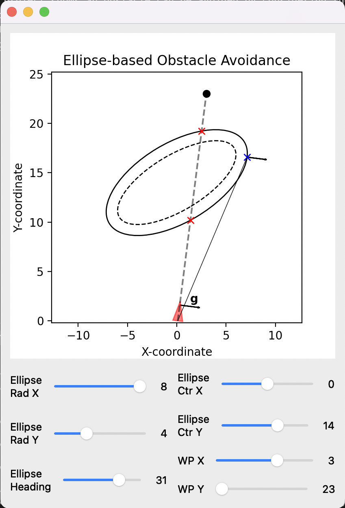

# Ellipse Obstacle Avoidance

This project shows an obstacle can be avoided by considering the obstacle as an ellipse. Suppose an aircraft is flying towrads a way point and an obstacle is detected in between the aircraft and the target, an intermediate waypoint can be created. The creation of an intermediate way point can be done by solving an optimization problem as discussed by [R.A. Sasongko, et al.](https://www.researchgate.net/publication/315909337_UAV_Obstacle_Avoidance_Algorithm_Based_on_Ellipsoid_Geometry). Figure below shows an example of the intermediate point result.

During my undergraduate thesis, I implemented this method to a quadcopter. A commerical off the shelf flight controller is used for the stabilization while an Arduino is installed to read data from ultrasonic sensors and commanding the drone. The result can be seen in the image below (redirected to a youtube link)

